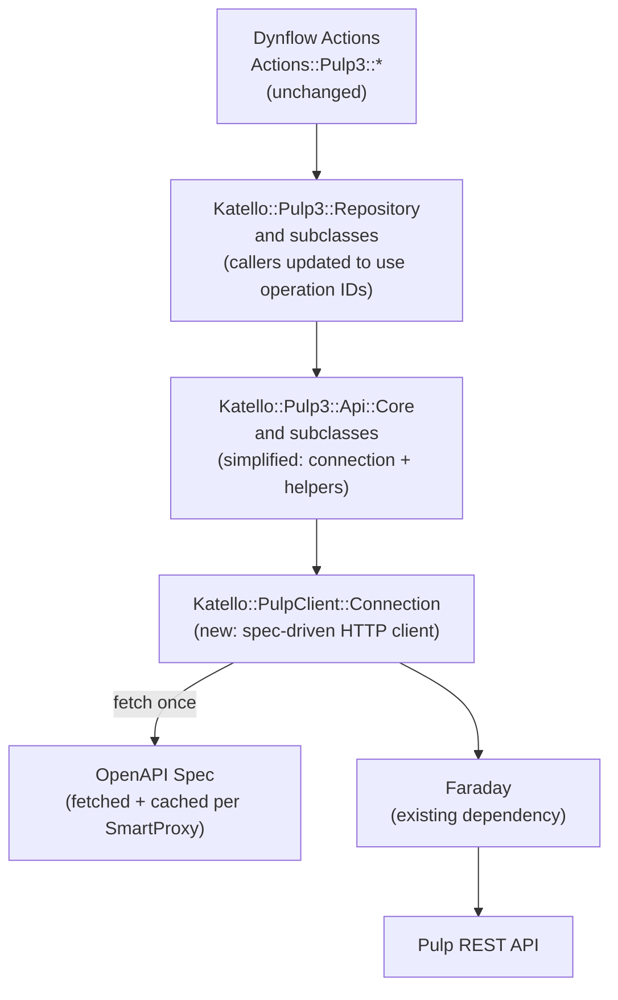

# Replace Pulp Binding Gems with a Spec-Driven HTTP Client

**Jira:** [SAT-36141](https://redhat.atlassian.net/browse/SAT-36141)
**Date:** 2026-03-20

## Problem

Katello depends on 9 tightly-pinned generated Pulp client gems (`pulpcore_client`, `pulp_rpm_client`, `pulp_deb_client`, `pulp_container_client`, `pulp_ansible_client`, `pulp_file_client`, `pulp_python_client`, `pulp_ostree_client`, `pulp_certguard_client`). When Pulp's API changes, Katello must bump gem pins and write monkey patches to bridge version differences between the gems (generated against one Pulp version) and the running server (a different version).

Today there are **3 monkey patch files** patching **~12 gem classes** for this reason:

- `lib/monkeys/pulp_polymorphic_remote_response.rb` -- patches 8 `Remote*Api` classes for Pulpcore 3.85 vs 3.90+ response deserialization skew
- `lib/monkeys/fix_rpm_repository_gpgcheck.rb` -- patches 2 RPM response classes for deprecated fields that the gems reject as `nil`
- `lib/monkeys/remove_hidden_distribution.rb` -- re-implements `initialize` for 7 distribution classes across 6 plugins because of `hidden` field default changes

**Constraint:** We must support Pulp versions spanning the current Katello release back through 4 releases (e.g., Katello 4.20 must support Pulp from 4.16 through 4.20).

## Core Idea

Every running Pulp server serves its own OpenAPI spec at:

```
GET /pulp/api/v3/docs/api.json
```

This is a ~2.2MB JSON document describing all ~1009 operations, their paths, HTTP methods, parameters, and schemas. Critically, the spec also embeds plugin version info:

```json
{
  "info": {
    "x-pulp-app-versions": {
      "core": "3.85.13",
      "rpm": "3.32.5",
      "deb": "3.8.1",
      "container": "2.26.7",
      "ansible": "0.28.5",
      "file": "3.85.13",
      "python": "3.19.1",
      "ostree": "2.5.3",
      "certguard": "3.85.13"
    }
  }
}
```

By fetching this spec at runtime, we let each Pulp server tell us how to talk to it, eliminating the need to hard-code endpoint paths or maintain binding gems.

### What the spec handles automatically

- **Endpoint paths** -- e.g., operationId `repositories_rpm_rpm_sync` maps to `POST {rpm_rpm_repository_href}sync/`
- **HTTP methods** for every operation
- **Parameter placement** -- the spec knows which params are path, query, or body
- **Plugin version info** -- `x-pulp-app-versions` replaces separate version-checking
- **Multi-version compatibility** -- each SmartProxy's Pulp serves its own spec for its own installed version; a Pulp 3.85 server describes 3.85's API, a 3.90 server describes 3.90's

### What still needs manual code (small surface)

- **Pagination loop** -- the `fetch_from_list` pattern (~15 lines, unchanged from today)
- **Task polling loop** -- poll until completed/failed (~20 lines, unchanged from today)
- **Behavioral version differences** -- e.g., HTTP 204 vs 202 on remote update in Pulpcore 3.90+ -- gated by `x-pulp-app-versions`
- **Correlation-ID header injection** -- moved into the connection layer

## Architecture



The Dynflow actions, `Katello::Pulp3::Repository` service classes, and `Katello::Pulp3::Task` polling remain structurally unchanged. The `Katello::Pulp3::Api::Core` layer (and its subclasses) is simplified: instead of constructing gem `*Api` objects, it delegates to a `PulpClient::Connection` that knows how to call any operation by its spec-defined `operationId`.

## Call Pattern Change

```ruby
# BEFORE (with binding gems):
sync_url_data = PulpRpmClient::RpmRepositorySyncURL.new(remote: href, mirror: true)
api.repositories_api.sync(repo_href, sync_url_data)

# AFTER (spec-driven):
api.call("repositories_rpm_rpm_sync",
  params: { rpm_rpm_repository_href: repo_href },
  body: { remote: href, mirror: true })
```

No hand-written wrapper per endpoint. The `operationId` tells the client to look up the path template and HTTP method from the cached spec. Request body objects (`PulpRpmClient::RpmRepositorySyncURL`, etc.) become plain Ruby Hashes.

## Current Scope: ~83 Unique Pulp API Calls

An audit of `app/services/katello/pulp3/**/*.rb` found **~83 unique (API object, method) pairs** that call Pulp today. These break down as:

- **~35** CRUD operations on core resources (tasks, uploads, artifacts, repos, versions, remotes, distributions, publications, signing services, orphans, repair)
- **~30** CRUD operations on per-plugin resources (rpm, deb, container, ansible, file, python, ostree, certguard)
- **~10** action methods (sync, copy_content, modify, tag, refresh, import_commits)
- **~8** export/import operations (exporters, importers, import checks)

None of these need hand-written endpoint methods in the new design; the spec provides the path and HTTP method for each.

---

## Option A: Custom Thin Spec-Driven Client (Recommended)

Build a minimal OpenAPI client (~300 lines of new code) inside Katello that uses Faraday.

### Pros

- No new dependencies (Faraday is already pinned in `katello.gemspec`)
- O(1) operation lookup via a pre-built Hash index
- Per-SmartProxy `Connection` instances with isolated SSL/auth config (supports Dynflow concurrency)
- Full control over caching, error handling, logging
- Can accept spec from a JSON string (no temp file needed)

### Cons

- We own the spec parsing code (~150 lines)
- No community maintenance of the parsing layer

### New Files

All under `app/services/katello/pulp_client/`:

#### `connection.rb` (~120 lines)

Core class. Fetches and caches the OpenAPI spec per SmartProxy. Builds a `{ operationId => { method:, path_template:, path_params: } }` index. Configures Faraday with SSL/auth. Provides `call(operation_id, params:, body:)`.

```ruby
module Katello
  module PulpClient
    class Connection
      SPEC_PATH = "/pulp/api/v3/docs/api.json"

      def initialize(uri:, username:, password:, ssl_opts:, timeout:, logger:)
        @faraday = build_faraday(uri, username, password, ssl_opts, timeout, logger)
        @spec_index = fetch_and_index_spec
        @versions = fetch_versions_from_spec
      end

      def call(operation_id, params: {}, body: nil)
        op = @spec_index.fetch(operation_id) do
          raise OperationNotFound, "Pulp operation '#{operation_id}' not in spec"
        end
        path = interpolate_path(op[:path_template], params)
        query = params.except(*op[:path_params])
        response = @faraday.run_request(op[:method], path, body&.to_json, {}) do |req|
          req.params.update(query) if query.any?
          req.headers["Content-Type"] = "application/json" if body
        end
        handle_response(response)
      end

      def supports?(operation_id)
        @spec_index.key?(operation_id)
      end

      def plugin_version(plugin)
        Gem::Version.new(@versions[plugin.to_s])
      end

      def plugin_at_least?(plugin, version)
        plugin_version(plugin) >= Gem::Version.new(version)
      end

      private
      # fetch_and_index_spec: GET spec, parse JSON, iterate paths to build index
      # interpolate_path: substitute {param_name} in path template
      # handle_response: return Response wrapper or raise ApiError
    end
  end
end
```

#### `response.rb` (~30 lines)

Thin Hash wrapper with no strict attribute validation. This single design choice eliminates all 3 current monkey patch files -- unknown fields are silently accessible, missing fields return `nil`.

```ruby
module Katello
  module PulpClient
    class Response
      def initialize(status:, body:)
        @status = status
        @data = body.is_a?(Hash) ? body.with_indifferent_access : body
      end

      attr_reader :status

      def method_missing(name, *)
        @data.is_a?(Hash) && @data.key?(name.to_s) ? @data[name.to_s] : super
      end

      def respond_to_missing?(name, *)
        (@data.is_a?(Hash) && @data.key?(name.to_s)) || super
      end

      def as_json(*) = @data.as_json
      def [](key) = @data[key]
      def results = @data["results"]
      def count = @data["count"]
    end
  end
end
```

#### `api_error.rb` (~20 lines)

Replaces all `PulpXClient::ApiError` classes with a single exception type that carries HTTP status, body, and message.

#### `plugin_requirement.rb` (~25 lines)

Value object holding a plugin name and PEP-440-style version specifier (using `Gem::Dependency` for matching). Used by quirks and capabilities.

#### `quirks.rb` (~80 lines)

Central registry for version-specific spec patches, response patches, and capability definitions. Modeled on pulp-glue's `@api_spec_quirk` / `@api_quirk` decorators and `CAPABILITIES` dict. See the **Quirks System** section below for full details.

#### `spec_parser.rb` (~80 lines)

Parses OpenAPI 3.0 JSON, resolves `$ref`s for parameters, and builds the operation index. The output is a flat Hash:

```ruby
{
  "repositories_rpm_rpm_sync" => {
    method: :post,
    path_template: "{rpm_rpm_repository_href}sync/",
    path_params: ["rpm_rpm_repository_href"]
  },
  "tasks_read" => {
    method: :get,
    path_template: "{task_href}",
    path_params: ["task_href"]
  },
  # ... ~1009 entries, indexed once
}
```

### Changes to Existing Files

- **`app/services/katello/pulp3/api/core.rb`** -- Replace `api_client`, `core_api_client`, and all `*_api` accessor methods with a `connection` accessor that returns the `PulpClient::Connection`. Add helper methods `call(op, ...)` and `paginated_call(op, ...)` that wrap `connection.call` with the existing `fetch_from_list` pagination logic.

- **`app/services/katello/pulp3/api/yum.rb`** (and `apt.rb`, `docker.rb`, `file.rb`, `ansible_collection.rb`, `generic.rb`, `content_guard.rb`) -- Remove all `*_api` accessor methods (e.g., `copy_api`, `content_package_groups_api`). These become unnecessary since callers use operation IDs directly.

- **`app/services/katello/pulp3/repository.rb`** (and all subclasses) -- Change calls from `api.repositories_api.sync(href, data_obj)` to `api.call("repositories_rpm_rpm_sync", params: { ... }, body: { ... })`. Replace gem PORO constructors (e.g., `PulpRpmClient::RpmRpmRemote.new(...)`) with plain Hashes.

- **`app/models/katello/concerns/smart_proxy_extensions.rb`** -- Replace `pulp3_configuration(config_class)` and `pulp3_ssl_configuration` with a single `pulp3_connection` method returning a `PulpClient::Connection` instance.

- **`lib/katello/repository_types/yum.rb`** (and all 6 other type files) -- Remove all gem class registrations (`client_module_class`, `api_class`, `remote_class`, `configuration_class`, `remotes_api_class`, etc.). The spec knows the paths; we only need the `operationId` prefixes per type (e.g., `"repositories_rpm_rpm"` for YUM).

- **`katello.gemspec`** -- Remove all 9 `pulp*_client` gem dependencies. Keep `faraday`.

- **Delete entirely:** `lib/monkeys/pulp_polymorphic_remote_response.rb`, `lib/monkeys/fix_rpm_repository_gpgcheck.rb`, `lib/monkeys/remove_hidden_distribution.rb`. Update `config/initializers/monkeys.rb` to remove the 3 Pulp-related requires.

- **Content-unit service files** (`app/services/katello/pulp3/rpm.rb`, `deb.rb`, `docker_manifest.rb`, etc.) -- Replace `PulpXClient::ContentYApi.new(api_client).list(...)` with `api.call("content_rpm_packages_list", ...)`.

---

## Option B: Reynard Gem

Use the existing [Reynard](https://github.com/Manfred/Reynard) gem (MIT license, Ruby) which is purpose-built for operating directly on OpenAPI specs without code generation.

### Pros

- Proven, tested OpenAPI spec consumer
- Handles `$ref` resolution, parameter grouping, body serialization, response model building out of the box
- Less new code to write and own

### Cons

- **Small project** -- 15 GitHub stars, single maintainer
- **Global HTTP layer** -- `Reynard.http` is a class-level setting, not per-instance. Talking to multiple SmartProxies with different SSL certs and credentials requires either:
  - Swapping the global before each call (not thread-safe, breaks Dynflow concurrency)
  - Forking Reynard to support per-instance HTTP configuration (substantial change to their architecture)
- **Linear operation lookup** -- `specification.operation()` iterates all 735 paths on every call. With Katello's volume of Pulp calls, this needs memoization we'd have to add ourselves.
- **File-based spec loading** -- must save the fetched JSON to a temp file before Reynard can read it
- **Missing `allOf`/`oneOf`/`anyOf` support** -- [open issue #68](https://github.com/Manfred/Reynard/issues/68); Pulp's spec uses these constructs
- **New dependencies**: `multi_json`, `net-http-persistent`, `rack`
- Response model building may still enforce schema strictness that caused our current monkey patches

### Integration Approach

```ruby
# In smart_proxy_extensions.rb:
def pulp3_reynard
  spec_json = fetch_pulp_spec  # GET /pulp/api/v3/docs/api.json via Faraday
  tmpfile = write_to_tempfile(spec_json)
  reynard = Reynard.new(filename: tmpfile.path)
  reynard.base_url(pulp3_uri!.to_s)
  reynard.headers({ "Correlation-ID" => request_id })
  reynard
end

# In Api::Core:
def call(operation_id, params: {}, body: nil)
  ctx = connection.operation(operation_id)
  ctx = ctx.params(params) if params.any?
  ctx = ctx.body(body) if body
  response = ctx.execute
  # ... wrap response
end
```

### Blocking Risk: Global HTTP Layer

Reynard's HTTP client is set via `Reynard.http = ...` (class-level). For Katello's multi-SmartProxy architecture where each proxy has different SSL certs and credentials, this is a **blocking issue**. The options are:

- **Patch Reynard** to accept a per-context HTTP client (substantial fork of the gem)
- **Wrap calls with mutex + global swap** (thread-unsafe, defeats Dynflow's concurrent task execution)

This is the primary reason Option A is recommended over Option B.

---

## Recommendation

**Option A (Custom Client)** is recommended. The spec-driven approach eliminates the ~83 hand-written endpoint methods. The custom client is small (~300 lines of new code), introduces no new dependencies, handles per-SmartProxy SSL/auth naturally, and provides O(1) operation lookups. Reynard's global HTTP layer and missing `allOf`/`oneOf` support are blockers for our use case.

## Spec Caching Strategy

- Fetch the spec on first `call()` per SmartProxy instance (lazy initialization)
- Cache in-memory on the `Connection` object (tied to SmartProxy lifecycle)
- The spec is ~2.2MB JSON; parsing takes ~50-100ms -- acceptable as a one-time cost
- If a SmartProxy's Pulp is upgraded, a Foreman restart or explicit `connection.refresh!` rebuilds the cache

## Quirks System (Version-Specific Behavior)

Pulp-glue handles version-specific API differences through a system it calls **"quirks"**. Our design borrows the same three-layer approach, adapted to Ruby.

### Layer 1: Spec Quirks (patch the spec before use)

Sometimes the OpenAPI spec served by a Pulp version is itself incorrect or incomplete -- a field has the wrong type, a parameter is missing, or a response schema doesn't match reality. Pulp-glue handles this with `@api_spec_quirk`: a decorated function that mutates the raw spec dict, gated by a `PluginRequirement` version check.

Our equivalent:

```ruby
# app/services/katello/pulp_client/quirks.rb
module Katello
  module PulpClient
    module Quirks
      # Registry of spec-level quirks. Each quirk is a callable that receives
      # the raw spec Hash and mutates it, gated by a PluginRequirement.
      @spec_quirks = []

      def self.register_spec_quirk(plugin:, specifier:, description:, &block)
        @spec_quirks << {
          requirement: PluginRequirement.new(plugin, specifier),
          description: description,
          patch: block
        }
      end

      def self.apply_spec_quirks(spec, versions)
        @spec_quirks.each do |quirk|
          if quirk[:requirement].satisfied_by?(versions)
            quirk[:patch].call(spec)
          end
        end
        spec
      end

      # Example: Pulpcore < 3.90 spec incorrectly documents remote update
      # as returning the RemoteResponse model instead of AsyncOperationResponse
      register_spec_quirk(
        plugin: "core",
        specifier: "< 3.90",
        description: "Remote update returns AsyncOperationResponse, not RemoteResponse"
      ) do |spec|
        # Patch the spec so the operation index has the correct response info
        %w[
          remotes_rpm_rpm_partial_update remotes_rpm_rpm_update
          remotes_ansible_collection_partial_update
          remotes_container_container_partial_update
        ].each do |op_id|
          op = find_operation(spec, op_id)
          next unless op
          op["responses"]["202"]["content"]["application/json"]["schema"] =
            { "$ref" => "#/components/schemas/AsyncOperationResponse" }
        end
      end
    end
  end
end
```

Spec quirks are applied once, right after fetching the spec and before building the operation index. They are the equivalent of today's monkey patches but centralized and version-gated.

### Layer 2: Capabilities (feature gating)

Some Pulp features only exist in certain plugin versions. Rather than letting a call fail with a cryptic 404 or 405, we declare capabilities and check them before attempting the operation. This is directly modeled on pulp-glue's `CAPABILITIES` dict.

```ruby
# app/services/katello/pulp_client/capabilities.rb
module Katello
  module PulpClient
    module Capabilities
      DEFINITIONS = {
        "rpm_prune_packages" => [
          PluginRequirement.new("rpm", ">= 3.25.0")
        ],
        "import_export" => [
          PluginRequirement.new("core", ">= 3.21.0")
        ],
        "repository_labels" => [
          PluginRequirement.new("core", ">= 3.34.0")
        ],
        "reclaim_space" => [
          PluginRequirement.new("core", ">= 3.19.0")
        ]
      }.freeze

      def has_capability?(capability, versions)
        reqs = DEFINITIONS[capability]
        return false unless reqs
        reqs.all? { |req| req.satisfied_by?(versions) }
      end

      def needs_capability!(capability, versions)
        return if has_capability?(capability, versions)
        reqs = DEFINITIONS[capability]
        raise UnsupportedCapability,
          "Capability '#{capability}' requires: #{reqs.map(&:to_s).join(', ')}"
      end
    end
  end
end
```

Usage in Katello code:

```ruby
def prune_packages(repo_href, options)
  connection.needs_capability!("rpm_prune_packages")
  connection.call("rpm_prune_prune_packages", body: options)
end
```

### Layer 3: Request/Response Quirks (behavioral differences)

Some version differences aren't in the spec but in how the server behaves -- for example, Pulpcore 3.90+ returning HTTP 204 (no-op) vs 202 (async task) on remote updates. These are handled as version-gated logic in the `Connection` or calling code, similar to pulp-glue's `preprocess_entity` pattern.

```ruby
# app/services/katello/pulp_client/quirks.rb (continued)
module Katello
  module PulpClient
    module Quirks
      @response_quirks = []

      # Register a quirk that post-processes a response for specific operations
      def self.register_response_quirk(operations:, plugin:, specifier:, description:, &block)
        @response_quirks << {
          operations: Array(operations),
          requirement: PluginRequirement.new(plugin, specifier),
          description: description,
          handler: block
        }
      end

      def self.apply_response_quirks(operation_id, response, versions)
        @response_quirks.each do |quirk|
          next unless quirk[:operations].include?(operation_id)
          next unless quirk[:requirement].satisfied_by?(versions)
          response = quirk[:handler].call(response)
        end
        response
      end

      # Example: Pulpcore >= 3.90 returns 204 on remote update when no changes
      register_response_quirk(
        operations: %w[
          remotes_rpm_rpm_partial_update remotes_rpm_rpm_update
          remotes_ansible_collection_partial_update
          remotes_container_container_partial_update
          remotes_ostree_ostree_partial_update
        ],
        plugin: "core",
        specifier: ">= 3.90",
        description: "Remote update returns 204 (no-op) when no changes detected"
      ) do |response|
        response.status == 204 ? nil : response
      end
    end
  end
end
```

### The `PluginRequirement` helper

A small value object (modeled directly on pulp-glue's `PluginRequirement`) that holds a plugin name and version specifier:

```ruby
# app/services/katello/pulp_client/plugin_requirement.rb
module Katello
  module PulpClient
    class PluginRequirement
      attr_reader :plugin, :specifier, :description

      def initialize(plugin, specifier = nil, description: nil)
        @plugin = plugin.to_s
        @specifier = specifier
        @description = description
      end

      def satisfied_by?(versions)
        version = versions[@plugin]
        return false unless version
        return true unless @specifier
        Gem::Dependency.new("", @specifier).match?("", version)
      end

      def to_s
        @specifier ? "#{@plugin} #{@specifier}" : @plugin
      end
    end
  end
end
```

### How quirks flow through Connection

```ruby
# In Connection#initialize (simplified):
def initialize(...)
  @faraday = build_faraday(...)
  raw_spec = fetch_spec
  @versions = raw_spec["info"]["x-pulp-app-versions"]

  # Layer 1: Apply spec quirks before indexing
  Quirks.apply_spec_quirks(raw_spec, @versions)

  @spec_index = build_operation_index(raw_spec)
end

# In Connection#call:
def call(operation_id, params: {}, body: nil)
  op = @spec_index.fetch(operation_id) { raise OperationNotFound, "..." }
  # ... build path, make HTTP request ...
  response = handle_response(http_response)

  # Layer 3: Apply response quirks
  Quirks.apply_response_quirks(operation_id, response, @versions)
end
```

### Lifecycle: when to add and remove quirks

Each quirk registration includes a `description` and is gated by a version specifier. When the minimum supported Pulp version moves past the quirk's range, the quirk becomes dead code and can be removed. A rake task or test can verify this:

```ruby
# Example test or rake task:
Quirks.spec_quirks.each do |quirk|
  unless quirk[:requirement].could_apply?(MINIMUM_SUPPORTED_VERSIONS)
    warn "Quirk '#{quirk[:description]}' can be removed -- " \
         "minimum supported #{quirk[:requirement]} is past the quirk range"
  end
end
```

### Current monkey patches mapped to quirks

| Current Monkey Patch | Quirk Layer | Registration |
|---|---|---|
| `pulp_polymorphic_remote_response.rb` (8 Remote API classes) | Response quirk + Spec quirk | `plugin: "core", specifier: "< 3.90"` for spec; `">= 3.90"` for 204 handling |
| `fix_rpm_repository_gpgcheck.rb` (nil field rejection) | **Eliminated** -- `Response` wrapper accepts any fields | N/A |
| `remove_hidden_distribution.rb` (7 distribution classes) | **Eliminated** -- `Response` wrapper has no strict defaults | N/A |

Two of the three current monkey patches disappear entirely because the `Response` wrapper doesn't validate fields. Only the remote update behavioral change needs a quirk registration.

## Migration Order

1. Build `PulpClient::Connection`, `Response`, `ApiError`, `SpecParser`, `PluginRequirement` (new files)
2. Build `PulpClient::Quirks` -- register spec quirks, response quirks, and capabilities to replace existing monkey patches
3. Update `SmartProxy#pulp3_connection` to return the new `Connection`
4. Update `Api::Core` to use `connection.call(...)` + pagination helpers
5. Update `Api::*` subclasses and all `Pulp3::Repository` callers
6. Update content-unit service files (`rpm.rb`, `deb.rb`, etc.)
7. Remove gem dependencies from `katello.gemspec`, delete monkey patches
8. Update tests (stub at Faraday level using `Faraday::Adapter::Test`)
9. Add a CI or rake task to flag quirks whose version ranges no longer overlap with the supported Pulp version window

Steps 1-5 can proceed with the gems still present in the gemspec (the new code is additive). Step 6 is the final cutover. This makes it safe to develop and test incrementally on a branch before the switch.

## Open Questions

1. Should the `operationId` strings be referenced directly as string literals in calling code, or defined as constants (e.g., `Katello::PulpClient::Operations::RPM_SYNC = "repositories_rpm_rpm_sync"`)? Constants add indirection but provide autocompletion and typo prevention.
2. Should we cache the parsed spec to disk (e.g., Redis or a file) to avoid re-fetching on every Foreman worker restart, or is a ~100ms fetch per worker acceptable?
3. How should the `connection.refresh!` mechanism be triggered after a SmartProxy Pulp upgrade -- manually via rake task, automatically on version mismatch detection, or only on restart?
